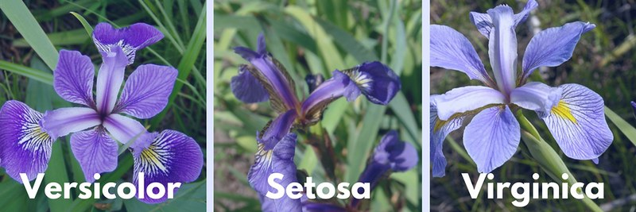

## Conjunto de datos Iris.

```{r data}
library(ggplot2)
data(iris)
summary(iris)
```

## Matriz de correlación.

```{r cor}
cor(iris[,-5])
```

Se observa que las variables más correlacionadas son longitud del petalo y ancho del petalo, las cuales tienen una correlación positiva y fuerte del 0.96.

## Histogramas

```{r hist1}
ggplot(iris, aes(x=Sepal.Length))+
  geom_histogram(fill="red")
```

```{r hist2}
ggplot(iris, aes(x=Sepal.Width))+
  geom_histogram(fill="blue")
```

```{r hist3}
ggplot(iris, aes(x=Petal.Length))+
  geom_histogram(fill="green")
```

```{r hist4}
ggplot(iris, aes(x=Petal.Width))+
  geom_histogram(fill="gold")
```


## Diagramas de cajas por Specie.

```{r caja1}
ggplot(iris, aes(y=Sepal.Length, x=Species, fill=Species))+
  geom_boxplot()
```

Se observa que la Specie Virginica es la que tiene mayor longitud del sepalo.

```{r caja2}
ggplot(iris, aes(y=Sepal.Width, x=Species, fill=Species))+
  geom_boxplot()
```

```{r caja3}
ggplot(iris, aes(y=Petal.Length, x=Species, fill=Species))+
  geom_boxplot()
```

```{r caja4}
ggplot(iris, aes(y=Petal.Width, x=Species, fill=Species))+
  geom_boxplot()
```


## Panel Gráficos.

```{r panel1}
library(gridExtra)

g1 = ggplot(iris, aes(y=Sepal.Length, x=Species, fill=Species))+
  geom_boxplot()

g2 = ggplot(iris, aes(y=Sepal.Width, x=Species, fill=Species))+
  geom_boxplot()

g3 = ggplot(iris, aes(y=Petal.Length, x=Species, fill=Species))+
  geom_boxplot()

g4 = ggplot(iris, aes(y=Petal.Width, x=Species, fill=Species))+
  geom_boxplot()

grid.arrange(g1,g2,g3,g4)
```


## Graficos de Dispersión.

```{r dispersion1, echo=FALSE, message=FALSE}
ggplot(iris, aes(x=Petal.Length, y=Petal.Width))+
  geom_jitter(colour="blue")+
  geom_smooth(method="lm", colour="red")
## echo false: permite que no aparezca el codigo de R en el informe.
## message false: permite que no salgan mensajes de R en el informe.
```


## Imagenes.



## Conclusiones

* La flor Virginica es la que presenta mayor dimensión respecto al Petalo.
* La flor Setosa es la que presenta menor dimensión respecto al Petalo.
* Existe una correlación positiva y fuerte entre Petal.Length y Sepal Length, donde la correlación es igual a 0.96.


